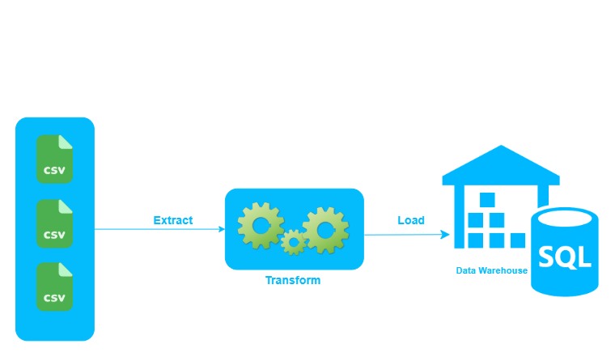
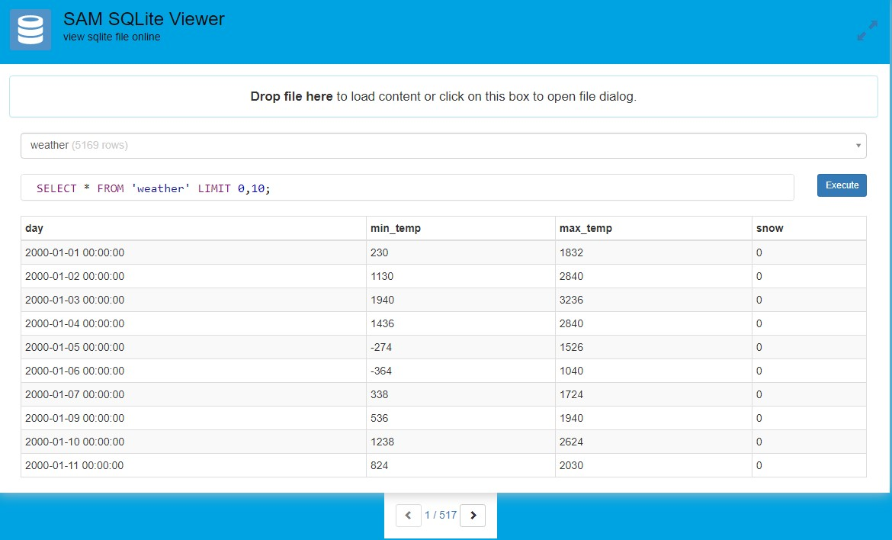

# Extract Transform Load Weather Data


<!-- PROJECT LOGO -->
<br />
<p align="center">
  <a href="https://github.com/saboye/Data-Modeling-with-Postgrese">
    
  </a>

  <h1 align="center">ETL</h1>

  <p align="center">
    project description
    <br />
    <a href="https://github.com/saboye/Data-Modeling-with-Postgres"><strong>Explore the docs »</strong></a>
    <br />
    <br />
    <a href="https://github.com/saboye/Data-Modeling-with-Postgres">View Demo</a>
    ·
    <a href="https://github.com/saboye/Data-Modeling-with-Postgres/issues">Report Bug</a>
    ·
    <a href="https://github.com/saboye/Data-Modeling-with-Postgres/issues">Request Feature</a>
  </p>
</p>

# Table of contents
1. [About The Project](#About_The_Project)
2. [Installation](#Installation)
3. [Schema](#Schema)
4. [Data Wearhouse demo](#Data_Wearhouse_demo)
5. [License](#License)
6. [Contact]("#Contact")
7. [Acknowledgements](#Acknowledgements)


<!-- ABOUT THE PROJECT -->
## About The Project <a name="About_The_Project"></a>

In this project, I am creating an ETL pipeline that extracts a database schema using a Postgre Relational database.  The project tasks need to define the data warehouse Schema for a particular analytic using SQLite. 


## Installation <a name="Installation"></a>
1. requirement  
```py
pip install pysqlite
```
2, 
```sh
git clone https://github.com/saboye/Extract-Transform-Load-Weather-Data.git

```
### Schema <a name="Schema"></a>
```sql
CREATE TABLE IF NOT EXISTS weather (
    day DATE,	    -- day of measurements
    min_temp FLOAT, -- min temperature in Fahrenheit
    max_temp FLOAT, -- max temperature in Fahrenheit
    snow INTEGETR   -- snow in inches
);

CREATE INDEX IF NOT EXISTS weather_day ON weather(day);
```

### Data Wearhouse demo<a name="Data_Wearhouse_demo"></a>

To see or to make a SQL query, After downloadingp please drag and drop the `weather.db` to https://db.samuelaboye.dev/



<!-- LICENSE -->
## License <a name="License"></a>

Distributed under the MIT License. See [LICENSE](https://github.com/saboye/Extract-Transform-Load-Weather-Data/blob/master/LICENSE.txt) for more information.

<!-- CONTACT -->
## Contact <a name="Contact"></a>

Your Name - [@saboye](https://twitter.com/saboye1) 

Project Link: [https://github.com/saboye/Extract-Transform-Load-Weather-Data](https://github.com/saboye/Extract-Transform-Load-Weather-Data)


<!-- ACKNOWLEDGEMENTS -->
## Acknowledgements <a name="Acknowledgements"></a>

* [https://www.postgresql.org/](https://www.postgresql.org/)
* [https://www.antwak.com/](https://www.antwak.com/)
* [https://www.postgresqltutorial.com/](https://www.postgresqltutorial.com/)
* [https://www.draw.io](https://www.draw.io/index.html)

